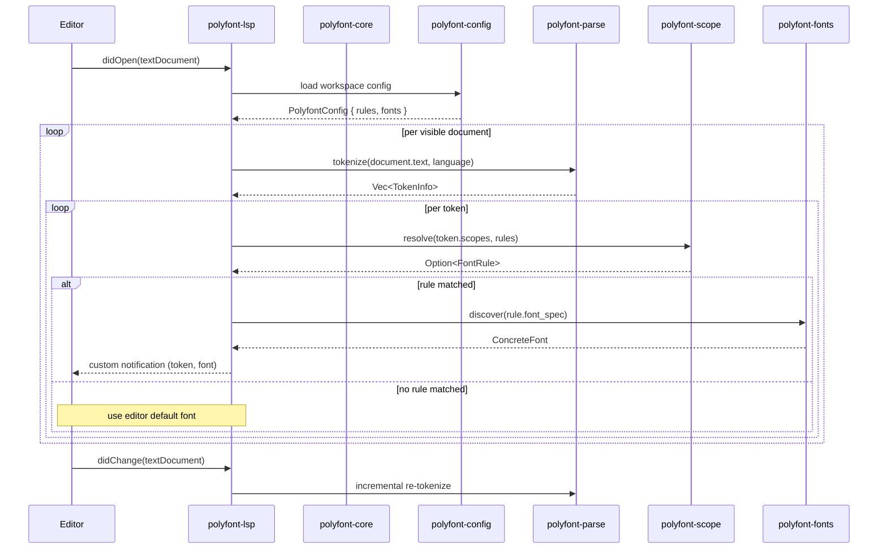

# Polyfont Architecture

## Overview

Polyfont is a per-token font highlighting system that maps TextMate scopes to font families, enabling mixed-font rendering within a single source file. It is implemented as a Rust monorepo with feature-gated crates for each concern: configuration, scope matching, tokenization, font discovery, theme management, and editor integration.

The core pipeline reads a configuration defining scope-to-font rules, parses source files into tokens annotated with TextMate scopes, resolves the most specific matching rule for each token, and notifies the editor which font to render for that token.

---

## Component Diagram

```mermaid
C4Component
    title Polyfont Component Diagram

    Container_Boundary(mono, "polyfont monorepo") {
        Component(core, "polyfont-core", "Rust library", [
            "TokenInfo",
            "FontSpec",
            "FontRule",
            "ScopeMatchEngine"
        ])
        Component(config, "polyfont-config", "Rust library", [
            "TOML parser",
            "ConfigLoader",
            "PolyfontConfig"
        ])
        Component(scope, "polyfont-scope", "Rust library", [
            "ScopePattern",
            "ScopeResolver",
            "TrieScopeResolver",
            "ScopeTree"
        ])
        Component(parse, "polyfont-parse", "Rust library", [
            "tree-sitter tokenization",
            "10 language grammars",
            "naive fallback tokenizer"
        ])
        Component(fonts, "polyfont-fonts", "Rust library", [
            "FontDiscovery trait",
            "platform-specific implementations"
        ])
        Component(themes, "polyfont-themes", "Rust library", [
            "ThemeImporter",
            "ThemeExporter",
            "ThemeRegistry"
        ])
        Component(lsp, "polyfont-lsp", "Rust binary", [
            "tower-lsp server",
            "font assignment notification"
        ])
        Component(cli, "polyfont-cli", "Rust binary", [
            "check",
            "vscode",
            "neovim",
            "kitty",
            "dump",
            "font",
            "theme"
        ])
    }

    Container(vscode, "VSCode Extension", "TypeScript")
    Container(neovim, "Neovim Plugin", "Lua")

    Rel(config, core, "provides FontRule[]")
    Rel(parse, core, "provides TokenInfo[]")
    Rel(scope, core, "resolves scopes against rules")
    Rel(fonts, core, "resolves FontSpec to concrete font")
    Rel(themes, config, "provides default rule sets")
    Rel(core, lsp, "drives LSP notifications")
    Rel(core, cli, "drives CLI subcommands")
    Rel(lsp, vscode, "textDocument/fontAssignment")
    Rel(lsp, neovim, "textDocument/fontAssignment")
```

### Crate Responsibilities

| Crate | Role |
|---|---|
| `polyfont-core` | Shared types (`TokenInfo`, `FontSpec`, `FontRule`) and the `ScopeMatchEngine` that ties the pipeline together. |
| `polyfont-config` | Parses `[polyfont.toml]` via serde, validates rules, and exposes `ConfigLoader` and `PolyfontConfig`. |
| `polyfont-scope` | TextMate scope pattern matching. `ScopePattern` represents a single pattern; `TrieScopeResolver` provides O(k) lookup; `ScopeTree` models the scope stack at a token. |
| `polyfont-parse` | Tokenizes source text using tree-sitter grammars (10 languages, feature-gated). Falls back to a naive line-based tokenizer when no grammar is available. |
| `polyfont-fonts` | Discovers available fonts on the host system via the `FontDiscovery` trait. Platform-specific implementations query fontconfig (Linux), CoreText (macOS), DirectWrite (Windows). |
| `polyfont-themes` | Imports and exports theme files. `ThemeRegistry` indexes built-in and user themes. `ThemeImporter`/`ThemeExporter` handle serialization. |
| `polyfont-lsp` | Language Server Protocol server built on tower-lsp. Sends font assignment diagnostics or custom notifications to connected editors. |
| `polyfont-cli` | Entry point for all subcommands: `check` (validate config), `vscode`/`neovim`/`kitty` (generate editor config), `dump` (debug output), `font` (query system fonts), `theme` (manage themes). |

---

## Data Flow



### Incremental Updates

On `didChange`, the LSP requests an incremental re-tokenization from `polyfont-parse` (tree-sitter supports incremental parsing). Only tokens in the changed region are re-resolved, minimizing per-keystroke latency.

---

## Scope Matching Algorithm

Polyfont resolves font rules using a most-specific-wins strategy.

### Specificity

Specificity is defined as the number of dot-separated segments in the matched scope. Given two rules that both match a token's scope stack, the rule whose pattern has the higher segment count wins.

```
source.rust            -> specificity 2
source.rust.meta.function  -> specificity 4
```

A token with scope stack `["source.rust", "meta.function", "entity.name.function"]` matches both rules above. The second rule wins with specificity 4.

### Trie Lookup

`TrieScopeResolver` stores all rule patterns in a trie keyed on dot-separated segments. For a token with scope stack depth k, lookup is O(k) per scope in the stack, yielding O(k * m) total where m is the stack depth (typically < 10). This is significantly faster than naive linear scanning over all rules.

### Wildcard Catch-All

The pattern `*` matches any token that did not match a more specific rule. It has specificity 1. If multiple wildcard patterns exist, the last one defined in the configuration wins.

### Resolution Order

1. Iterate over the token's scope stack from innermost (most specific) to outermost.
2. For each scope, walk the trie to find matching rules.
3. Among all matches across the full stack, select the rule with the highest specificity.
4. Break ties by configuration order (last-defined wins).

---

## Platform Support Matrix

| Editor | Integration Type | Font API | Status |
|---|---|---|---|
| VSCode | Native extension (TypeScript) | `editor.setFontFamily` via decoration | Stable |
| Neovim | Plugin (Lua) + LSP client | `nvim_buf_set_extmarks` with `hl_group` + GUI font | Stable |
| Helix | Kitty protocol | `kitty +kitten @ --to ...` symbol_map approximation | Experimental |
| Zed | Extension (WASM) | `text_style_overrides` in settings | Experimental |
| Sublime Text | `.sublime-theme` generation | `font.face` property in sublime-theme | Planned |
| Kakoune | Faces config generation | `set-face` with `@family` | Planned |

### Integration Approaches

- **LSP-driven**: VSCode and Neovim connect to `polyfont-lsp` as a client. The server pushes font assignments as custom notifications. The editor extension maps these to its native font API.
- **Config generation**: For editors without LSP client support (Helix, Kakoune), `polyfont-cli` generates static configuration files. These are approximate because they map scopes to highlight groups or symbol maps rather than per-token font changes.
- **WASM extension**: Zed runs extensions as WebAssembly. A polyfont Zed extension consumes the core crates compiled to WASM and applies `text_style_overrides`.

---

## Extension Points

### Adding a New Language

1. Add a tree-sitter grammar dependency to `polyfont-parse/Cargo.toml` behind a feature gate:

   ```toml
   [features]
   lang-haskell = ["tree-sitter-haskell"]
   tree-sitter-haskell = { version = "0.23", optional = true }
   ```

2. Implement the `Tokenizer` trait for the new language in `polyfont-parse/src/langs/haskell.rs`.
3. Register the tokenizer in `polyfont-parse/src/lib.rs` behind the same feature gate.
4. Add the language identifier to `polyfont-config`'s known languages list.

If no tree-sitter grammar exists, the naive fallback tokenizer will apply, producing tokens with the `source.<lang>` scope only.

### Adding a New Theme

1. Implement the `BuiltInTheme` trait from `polyfont-themes`:

   ```rust
   pub trait BuiltInTheme {
       fn name(&self) -> &str;
       fn rules(&self) -> Vec<FontRule>;
   }
   ```

2. Register the theme with `ThemeRegistry` in `polyfont-themes/src/builtins.rs`.
3. The theme becomes available via `polyfont-cli theme list` and `polyfont-config` theme references.

### Adding a New Editor

Three options, in order of fidelity:

1. **LSP client** (highest fidelity): Implement a client that connects to `polyfont-lsp`, receives font assignment notifications, and applies them via the editor's native font API. This is the approach used by VSCode and Neovim.

2. **Config generation** (medium fidelity): Add a new subcommand to `polyfont-cli` that generates a static configuration file mapping scopes to font-related settings. This is the approach used for Helix and Kakoune.

3. **Standalone binary** (lowest fidelity): Consume `polyfont-core` and `polyfont-parse` directly in a standalone tool that produces annotated output for the editor to consume.

---

## Dependencies

### Key External Crates

| Crate | Purpose |
|---|---|
| `tower-lsp` | Async LSP server framework; powers `polyfont-lsp` |
| `tree-sitter` | Incremental parsing; core of `polyfont-parse` |
| `tree-sitter-*` | Per-language grammars (feature-gated) |
| `serde` / `serde_toml` | Configuration and theme serialization |
| `clap` | CLI argument parsing; powers `polyfont-cli` |
| `tokio` | Async runtime for LSP server |
| `thiserror` | Error types across crates |
| `tracing` | Structured logging and diagnostics |

### Internal Crate Dependencies

```
polyfont-cli    --> polyfont-core, polyfont-config, polyfont-fonts, polyfont-themes
polyfont-lsp    --> polyfont-core, polyfont-config, polyfont-parse, polyfont-scope, polyfont-fonts
polyfont-themes --> polyfont-core
polyfont-config --> polyfont-core
polyfont-scope  --> polyfont-core
polyfont-parse  --> polyfont-core
polyfont-fonts  --> polyfont-core
```

All crates depend on `polyfont-core` for shared types. No crate depends on another crate outside this DAG.
